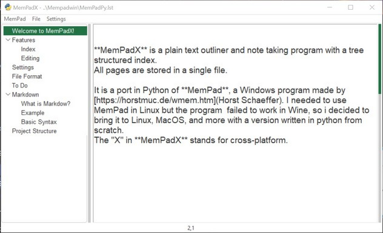

# MemPadX

## Welcome to MemPadX!

**MemPadX** is a plain text outliner and note taking program with a tree structured index. All pages are stored in a single file.

 

The **README.md** file you are reading right now has been written in MemPadX and exported to Markdown within the app. MemPadX is a very convinient way to write and organize your documentation.
 
It is a port in Python of **MemPad**, a Windows program made by 
[Horst Schaeffer](https://horstmuc.de/wmem.htm). I needed to use MemPad in Linux but the program  failed to work in Wine, so i decided to bring it to Linux, MacOS, and more with a version written in python from scratch. 

The "X" in **MemPadX** stands for cross-platform.

The version here, is the Python project exported to Windows with PyInstaller, just in case you'd rather use it without installing Python.

## Features

Editing functions :

-  Copy, cut, paste, undo/redo...
- Open files with drag&drop or menu
- Keep a fast access of the latest mempad files
- Save without prompting when you quit or open another mempad file
- An Auto-Save option (every 5 minutes) is available in settings.
- Designed as a "portable" program. 

Tree structure:

- Select a page with a single mouse click or by cursor control.
- Nodes can be added, renamed, or deleted with the right-click menu
- Drag&drop nodes to modify the tree structure.  
- Double-click on an item to rename the page title.
- MemPadX files can be exported to plain text, Markdown and to HTML.

Settings are stored in the **settings.ini** file
Settings can be changed in the Settings menu:

- No Backup : no backup at opening file
- ESC shortcut to quit.
- Auto Save every 5 minutes.
- Keep the app always on Top
 

This file was generated with PyInstaller:
python -m PyInstaller --name mempadx --noconsole -F --collect-all tkinterdnd2  --add-data "ressources/*.png;./ressources"  main.py 

 